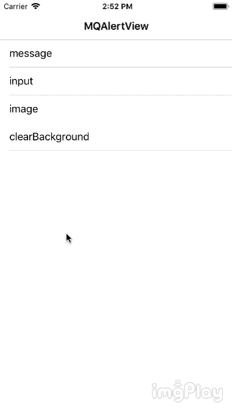

# MQAlertView
A simple customizable alertView that displays text, input boxes and pictures

## Installation
### using Carthage
Cartfile
`github "xiaoyao250/MQAlertView"`
input Framework
Target -> Build Setting  ->  Framework Search Path add this:
`$(SRCROOT)/Carthage/Build/iOS`
## Example
### simple way to show alert view
show text
```
let al = MQAlertView(title: "title",
placeholder: "placeholder",
btnDoneTitle: "certain")
al.show(animated: true)
```
show image
```
let al = MQAlertImageView()
al.getImageView().image = UIImage(named: "1")
al.show(animated: false)
```
set properties
```
let al = MQAlertImageView()
al.getBtnCancel().setTitleColor(.gray, for: .normal)
al.getBtnCancel().setTitle("cancel", for: .normal)
al.show(animated: false)
```
## Author

892895471@qq.com

## License

MQAlertView is available under the MIT license. See the LICENSE file for more info.
